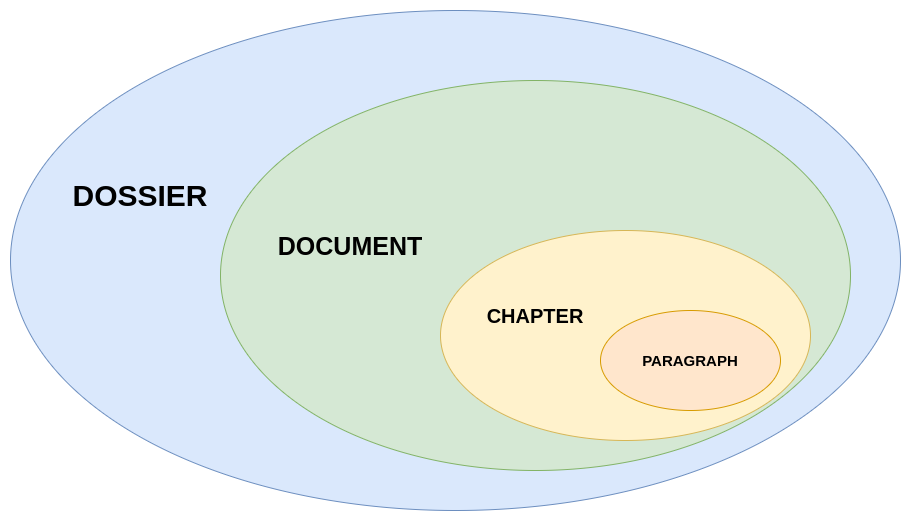

> [!WARNING]
> NMD syntax is working in progress yet, you can contribute following [contribution guidelines](CONTRIBUTING.md)!  

- [Structure](#structure)
    - [Dossier](#dossier)
      - [Dossier configuration](#dossier-configuration)
        - [name](#name)
        - [toc](#toc)
        - [documents](#documents)
        - [style](#style)
        - [references](#references)
        - [bibliography](#bibliography)
        - [compilation](#compilation)
- [NMD Syntax](#nmd-syntax)
  - [Heading (Title of a chapter)](#heading-title-of-a-chapter)
    - [Compact heading](#compact-heading)
    - [Relative heading](#relative-heading)
    - [Annotations](#annotations)
  - [Inline modifier](#inline-modifier)
    - [Escape](#escape)
    - [Metadata \[NOT SUPPORTED YET\]](#metadata-not-supported-yet)
    - [Reference](#reference)
    - [Bold](#bold)
    - [Italic](#italic)
    - [Strikethrough](#strikethrough)
    - [Underlined](#underlined)
    - [Checkbox](#checkbox)
    - [Color, Highlight and Font](#color-highlight-and-font)
      - [Compatible highlight text](#compatible-highlight-text)
    - [Embedded style](#embedded-style)
    - [Identifier](#identifier)
    - [Emoji](#emoji)
    - [Superscript](#superscript)
    - [Subscript](#subscript)
    - [Link](#link)
    - [Inline code](#inline-code)
    - [Inline math](#inline-math)
    - [Inline comments](#inline-comments)
    - [Greek letters](#greek-letters)
    - [Bookmark](#bookmark)
      - [Abridged bookmark](#abridged-bookmark)
      - [Bookmark](#bookmark-1)
      - [Todo](#todo)
    - [Cite](#cite)
  - [Paragraph modifier](#paragraph-modifier)
    - [Embedded style](#embedded-style-1)
    - [Image](#image)
      - [Abridged Image](#abridged-image)
      - [Multi Image](#multi-image)
    - [Page break](#page-break)
    - [Line break](#line-break)
    - [List](#list)
    - [Code block](#code-block)
    - [Multiline comments \[TO BE DEFINE; NOT SUPPORTED YET\]](#multiline-comments-to-be-define-not-supported-yet)
    - [Focus block](#focus-block)
      - [Focus quote block](#focus-quote-block)
    - [Math block (LaTeX)](#math-block-latex)
    - [Chapter styles and metadata \[TO BE DEFINE; NOT SUPPORTED YET\]](#chapter-styles-and-metadata-to-be-define-not-supported-yet)
    - [Tables \[NOT SUPPORTED YET\]](#tables-not-supported-yet)


## Structure

There are several type of ways to write NMD.

The structure hierarchy is the following:

1. **Dossier**: structured project
2. **Document**: single NMD file having `.nmd` extension
3. **Chapter**: actual NMD text, it is identified by the heading and it has some paragraph
4. **Paragraph**: actual NMD text, it is the text block in a chapter. Each paragraph is separated by each other by two new lines (`\n\n`)



#### Dossier

A **dossier** is a structured project having one or more *NMD documents*.

It allows to manage a set of related NMD documents and their assets.

> **Asset** is a resource used in a document, e.g. an image, or a custom *style*. 

A dossier allows to write the content in different NMD files and than union them in a single output.

The actual structure of a dossier is the following:

- `assets/`
  - `images/`
  - `documents/`
  - `styles/`
  - ...
- `nmd.yml` or `nmd.json` called **dossier configuration**
- set of NMD document (having `.nmd` extension)

The `images/` directory contains... images! Such as `documents` which contains documents and `styles/` which contains custom style for dossier.

The custom style must be written in **CSS**. The CSS classes are specified in each following *modifier section*.

##### Dossier configuration

The **dossier configuration** is a YAML or JSON file which contains configuration parameters for the dossier.

Considering YAML version, it may have the following content:

```yaml
name: New Dossier

toc:
  include_in_output: false
  page_numbers: false
  plain: false
  maximum_heading_level: 4

documents:
- ./welcome.nmd

style:
  theme: Light
  styles: []
  list_bullets_configuration: []

references: {}

bibliography:
  title: Bibliography
  records: {}
  include_in_output: false

compilation:
  embed_local_image: true
  embed_remote_image: true
  compress_embed_image: true
  strict_image_src_check: true
  parallelization: true
  use_remote_addons: false
```

###### name

`name` is the name of dossier.

###### toc

`include_in_output` if it must be printed

`page_numbers`: if it must be had page numbers

`tabulated` if it must contains tabulations

`maximum_heading_level` maximum heading level which must be printed

To customize table of contents there are some classes: `toc`, `toc-title`, `toc-body`, `toc-item`, `toc-item-bullet`, `toc-item-content`, `toc-item-indentation`

###### documents

`documents` is a list where are specified the order of the documents in the final output.

###### style

`style` section has the *style configuration*.

`theme` specified the theme used to create output. It can be:

- `Light` (default)
- `Dark`
- `Vintage` is work in progress now 

`styles` refers to CSS files. They can be URLs or local files (if only file name is used, it is inferred `assets/styles/` as prefix) 

`list_bullets_configuration` is described in [list section](#list)

###### references

`references` allows to specify dossier variables.


###### bibliography

Each bibliography record has:

- `title` (**mandatory**)
- `year`
- `authors`
- `description`
- `url`

Style classes: `bibliography`, `bibliography-title`, `bibliography-body`, `bibliography-item`, `bibliography-item-title`, `bibliography-item-authors`, `bibliography-item-year`, `bibliography-item-url`

For example:

```
bibliography:
  title: Bibliography
  records: 
    bib1:
      title: "bib1"
    bib2:
      title: "bib1"
      authors:
        - A1
        - A2
        - A3
      year: 2024
    bib3:
      title: "bib1"
      description: "bib3 description"
  include_in_output: true
```


###### compilation

In `compilation` section you can specified the default values to use during compilation.

- `embed_local_image` (boolean): local images (specified by local path) are inserted in the output without reference, but embedded 
- `embed_remote_image` (boolean): remote images (specified by remote path, e.g. URL) are inserted in the output without reference, but embedded 
- `compress_embed_image` (boolean): compress embedded images
- `strict_image_src_check` (boolean): apply a strict check to image sources
- `parallelization` (boolean): if `true` parallelize execution of compilation
- `use_remote_addons` (boolean): if `true` use CDN instead of local CSS/Javascript to include third part library


## NMD Syntax

NMD syntax is based on [CommonMark](https://commonmark.org/), but add new concepts and modifiers.

> A **modifier** is a special combination of symbols which allows to modify the text style.

In the next section there are all modifiers of NMD.

### Heading (Title of a chapter)

**Style class**: `heading-#` (where `#` is the heading number, e.g. `heading-3`)

Create headings using `#` (up to 6 levels). `#` must be separated from text using a blank space ` `.

```markdown
# Heading 1

## Heading 2

...

###### Heading 6
```

#### Compact heading

It's possible to use this alternative format:

```
#1 Heading 1

#2 Heading 2

...

#6 Heading 6
```

#### Relative heading

It's possible to use this alternative format to refer previous heading level:

- `#-` $= \text{last heading level} - 1$
- `#+` $= \text{last heading level} + 1$
- `#=` $= \text{last heading level}$

For example:

```
#1 Heading 1

#+ Heading 2

#+ Heading 3

#- Heading 2

#= Heading 2
```

#### Annotations

```
@key value1;value2
```

- `id`
- `author`
- `date` of creation
- `intent`
- `style` (inline style, e.g. `color:red`)
- `styleclass` (style class, e.g. `bold-txt`)


### Inline modifier

TODO

#### Escape

You can prevent text modification using **escape**, i.e. `\`:

```
\*
\_
...
```

#### Metadata [NOT SUPPORTED YET]

**Metadata** are a set of data which gives information about document, project and so on.

The syntax is:

```
TBD
```

#### Reference

**Reference** is a... reference! You can use a fictitious name as a classic variable in the programming languages.

References must be set in dossier configuration (`nmd.json` or `nmd.yml`).

The syntax is below.

```
&reference&
```

#### Bold

**Style class**: `bold`

```markdown
**Bold**

or

__Bold__
```

#### Italic

**Style class**: `italic`

```markdown
_Italic_

or

*Italic*
```

#### Strikethrough

**Style class**: `strikethrough`

```
~~Strikethrough text~~
```

#### Underlined

**Style class**: `underlined`

```
++Underlined text++
```

#### Checkbox

**Style class**: `checkbox`, `checkbox-unchecked`, `checkbox-checked`

```
[x] or [x]
[] or [ ]
```


#### Color, Highlight and Font

**Style class**: `abridged-embedded-style`

Color can be written in hexadecimal if you use `#rrggbb` convention or you can use their names.

You can modify text color, text background and its font using this modifier:

```
[Custom colored text]#id{textColor;backgroundColor;fontName}
```

You can omit `id`.

You can omit font and background color if you want only modify text color.

```
[Only text color]{#rrggbb}
```

You can insert only background color or only text font using this convention:

```
[Only background]{;#rrggbb}
[Only font]{;;fontName}
```

##### Compatible highlight text

**Style class**: `highlight`

You can use also `==Highlight text==` to mark text. This uses the default highlight style.

#### Embedded style

**Style class**: `embedded-style`

```
[Custom text style]{{style}}
```

`style` is literally the css-like style to apply.

#### Identifier

**Style class**: `identifier`

You can mark with an identifier a piece of text using:

```
[Text]#the-id
```

You can combine identifier modifier with embedded style:

```
[Text]#the-id{textColor;backgroundColor;fontName}
[Text]#the-id{{style}}
```

#### Emoji

Two ways to add emoji:

- Copy and paste an emoji
- Using `:emojiCode:`, for example 🐫


#### Superscript

```
1^st^
```

> This modifier can be placed attached on other text.

#### Subscript

For example, if you want to write "water" in a more scientific way:

```
H~2~O
```

Pay attention, those are two single quote

> This modifier can be placed attached on other text.

#### Link

**Style class**: `link`

```markdown
[Link](http://https://github.com/nricciardi/nmd.com)
```

#### Inline code

**Style class**: `inline-code`

```markdown
`inline code`
```

#### Inline math

**Style class**: `inline-math`

```markdown
$inline math$
```

#### Inline comments

```
// this is a comment
```

#### Greek letters

**Style class**: `greek`

```
%a%

%b%

%athb%
...
```

```rust
HashMap::from([
    ("a", r"alpha"),
    ("b", r"beta"),
    ("g", r"gamma"),
    ("d", r"delta"),
    ("e", r"epsilon"),
    ("z", r"zeta"),
    ("n", r"eta"),
    ("th", r"theta"),
    ("i", r"iota"),
    ("k", r"kappa"),
    ("l", r"lambda"),
    ("m", r"mu"),
    ("nu", r"nu"),
    ("x", r"xi"),
    ("o", r"omicron"),
    ("p", r"pi"),
    ("r", r"rho"),
    ("s", r"sigma"),
    ("t", r"tau"),
    ("u", r"upsilon"),
    ("phi", r"phi"),
    ("chi", r"chi"),
    ("psi", r"psi"),
    ("w", r"omega"),

    ("A", r"Alpha"),
    ("B", r"Beta"),
    ("G", r"Gamma"),
    ("D", r"Delta"),
    ("E", r"Epsilon"),
    ("Z", r"Zeta"),
    ("N", r"Eta"),
    ("Th", r"Theta"),
    ("I", r"Iota"),
    ("K", r"Kappa"),
    ("L", r"Lambda"),
    ("M", r"Mu"),
    ("Nu", r"Nu"),
    ("X", r"Xi"),
    ("O", r"Omicron"),
    ("P", r"Pi"),
    ("R", r"Rho"),
    ("S", r"Sigma"),
    ("T", r"Tau"),
    ("U", r"Upsilon"),
    ("Phi", r"Phi"),
    ("Chi", r"Chi"),
    ("Psi", r"Psi"),
    ("W", r"Omega"),
])
```

#### Bookmark

**Bookmarks** are label which can be inserted in text body to mark a paragraph or a piece of paragraph.

##### Abridged bookmark

**Style class**: `abridged-bookmark`, `abridged-bookmark-title`

```
@[bookmark description]
@[bookmark description]#the-id
```

Description can be multi-lines.


##### Bookmark

**Style class**: `bookmark`, `bookmark-title`, `bookmark-description`

```
@[bookmark title](bookmark description)
@[bookmark title]#the-id(bookmark description)
```

##### Todo

**Style class**: `todo`, `todo-title`, `todo-description`, `abridged-todo`, `multiline-todo`

Todo is a special tag to insert... TODOs

```
@[TODO](description)
@[todo](description)
```

...or only as first characters of the line:

```
TODO: description
todo: description
```

Multiline todo:

```
TODO:
this is a multiline todo
:TODO
```

#### Cite

**Style class**: `cite`

```
some text^[bibliography-key]
```


### Paragraph modifier

#### Embedded style

**Style class**: `embedded-paragraph-style`, `abridged-embedded-paragraph-style`

```
[[Custom text
style]]{{style}}
```

`style` is literally the css-like style to apply.

```
[[Custom text
style]]{}
```

#### Image

**Style class**: `figure`, `image`, `image-caption`

```markdown


![Image]#id(http://url/a.png)

![Image]#id(http://url/a.png){maring:0;width:50vw}
```

##### Abridged Image

**Style class**: `figure`, `image`, `abridged-image`

```markdown
![(http://url/a.png)]

![(http://url/a.png)]#id

![(http://url/a.png)]#id{maring:0;width:50vw}
```

##### Multi Image

**Style class**: `figure`, `image`, `image-caption`, `abridged-image`, `images-container`, `image-container`

```
!!:space-between:[[
:center:![(wikipedia-logo.png)]#image-7{width:70%}
{width:45%;margin:0;}
]]
```

#### Page break

**Style class**: `page-break`

```
### or more #
```

#### Line break

**Style class**: `line-break`, `line-break-dash`, `line-break-star`, `line-break-plus`

To apply a line break use `---` (or more than 3 `-`) or `***` (or more than 3 `*`) or `+++` (or more than 3 `+`) in a new blank line.

#### List

**Style class**: `list`, `list-item`, `list-item-indentation`, `list-item-bullet`, `list-item-content` 

> Each list must have 2 or more items.

Different types of list are supported in NMD, below the list with modifier

- `-` default style bullet
- `*` full dot bullet
- `+` empty dot bullet
- `->` arrow bullet
- `--` dash bullet
- `|` to use more than one line in an item content
- `-[] or -[ ] or - [] or - [ ]` todo bullet
- `1. or 1) or a. or a) or I. or I)` ordered bullet (numerical, alphabetical, romans numbers)
- `&unicode;` UNICODE bullet

Using `tabs` or `   ` (3 spaces) you can create different list levels.

Style of first and second bullet types can be managed using the configuration file.

Actually, the behavior of bullets can be modified using [dossier configuration](#dossier-configuration). In particular, using `list_bullets_configuration`.

For each record, you must specified 4 fields:

- `from` (string): NMD bullet
- `to` (string): output bullet (`:checkbox:` or `:checkbox-checked:` to show *checkbox* bullets)
- `indentation_level` (number)
- `strict_indentation` (boolean): if `false` the actual rule use `>=` instead of `==` to check indentation

> The rules are checked in order.

Following an example:

```yaml
  list_bullets_configuration:
  - from: '|'
    to: '&#8205;'
    indentation_level: 0
    strict_indentation: false
  - from: '-'
    to: '&bull;'
    indentation_level: 0
    strict_indentation: true
  - from: '-'
    to: '&#9702;'
    indentation_level: 1
    strict_indentation: true
  - from: '-'
    to: '&#8211;'
    indentation_level: 2
    strict_indentation: false
  - from: '*'
    to: '&bull;'
    indentation_level: 0
    strict_indentation: false
  - from: +
    to: '&#9702;'
    indentation_level: 0
    strict_indentation: false
```

#### Code block

**Style class**: `code-block`

Code blocks use ``` as paragraph modifier.

It's possible to specify the language used in code block, as in CommonMark, writing language name after first three quotes.

NMD uses [PrimJS](https://prismjs.com/) to render code blocks. So, the supported languages (tag in parenthesis) are the same of that library:

- Python (python)
- Java (java)
- Javascript (javascript)
- PHP (php)
- HTML (html)
- CSS (css)
- Typescript (typescript)
- Kotlin (kotlin)
- ...

#### Multiline comments [TO BE DEFINE; NOT SUPPORTED YET]

```
/*
multi
line
comment
*/
```

#### Focus block

**Style class**: `focus-block`, `focus-block-type`, `focus-block-title`, `focus-block-type-title`, `focus-block-description`, `focus-block-type-description` (replace `type`)

Focus blocks allow to insert text in particular paragraph in which the text is highlighted.

There are many types of focus block:

- **quote**
- **note**
- **tip**
- **important**
- **warning**
- **caution**

The syntax is below.

```
::: warning
Watch out!!!
:::
```

##### Focus quote block

**Style class**: `focus-quote-block`, `focus-quote-block-type`, `focus-quote-block-title`, `focus-quote-block-type-title`, `focus-quote-block-description`, `focus-quote-block-type-description` (replace `type`)

```
> [!note]
> note...
```

> **Only** for `[!type]` pattern you can write `type` in uppercase (`TYPE`).

#### Math block (LaTeX)

**Style class**: `math-block`

Math block is a particular paragraph used to print mathematical formulas and more.

The paragraph modifier for math block is double $, i.e. `$$` to open and close blocks.

NMD uses [Katex](https://katex.org/) to render math blocks.


#### Chapter styles and metadata [TO BE DEFINE; NOT SUPPORTED YET]

In NMD each paragraph can be decorated with a set of **paragraph decorators**, i.e. **metadata**, **in-line styles** and **style classes**. 

There is a set of standard and custom styles which each indicates a particular style. These are guide lines, each editor could implement a standard style in different ways.

Metadata are introduced using `@`:

```
@ + metadata tag + single space + metadata content
```

Supported metadata:

- `author`
- `content` description of paragraph content
- `createdAt`
- `updatedAt`

A special metadata is the **id** which can be written in two alternatives ways:

```
#the-id
@id the-id
```

> the identifiers should be all in lowercase and each word should be separated using `-`.

Style classes are introduced using `.`, e.g. `.styleClass1`.

In-line styles use CSS (or SCSS/SASS based on editor) key-value modifiers, they haven't a symbol.

To add decorators to a paragraph you must insert `{}` in the line below title, in parenthesis each type of decorator has a particular symbol which introduces it. You can use `;` to separate decorator in the same line or a `\n` to insert decorator in multiple lines.

There is an example below.

```
## Foo title
{
    #the-id
    @author you
    @author yourFriend
    .styleClass1
    background-color: red
}
```

You can add decorators also to a single word using this syntax:

#### Tables [NOT SUPPORTED YET]

**Style class**: `table`, `table-header`, `table-header-row`, `table-body`, `table-footer`, `table-body-row`, `table-cell`, `table-left-cell`, `table-center-cell`, `table-right-cell`, `table-empty-cell`, `table-caption`

Each table has an table head, body and footer (like HTML tables). A table can have only head or only footer, but it must always have body.

**Standard syntax**:

```
| Syntax      | Description | Test Text     |
| :---        |    :----:   |          ---: |
| Header      | Title       | Here's this   |
| Paragraph   | Text        | And more      |
```

`:---` for column left alignment

`---:` for column right alignment

`:---:` for column center alignment


**Extended syntax**

```
| Syntax     :| Description |: Test Text   :|
| :---        |    :----:   |          ---: |
| Header     :| Title       | Here's this   |
| Paragraph   | Text       :| And more      |
|---|
|| Footer     |
[Caption]#table-id{style}
```

`:` to specify cell alignment

`:---` for column left alignment

`---:` for column right alignment

`:---:` for column center alignment


