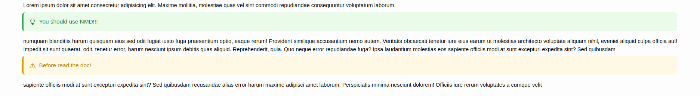

# New MarkDown [BETA]

**New way to write in markdown**

[](LICENSE)
[](CHANGELOG.md)

NMD stands for **New MarkDown**, or for friends, *Nicola MarkDown* (if Stephen Bourne can name a shell, why can't I name mine NMD?)

- [New MarkDown \[BETA\]](#new-markdown-beta)
  - [Overview](#overview)
    - [Why NMD?](#why-nmd)
      - [Performance](#performance)
      - [Extended Syntax](#extended-syntax)
      - [Order with Integrated Dossiers](#order-with-integrated-dossiers)
      - [Predefined Styles and Customization](#predefined-styles-and-customization)
      - [Cool Factor](#cool-factor)
  - [NMD x VS Code](#nmd-x-vs-code)
  - [Getting Started](#getting-started)
    - [TL;DR](#tldr)
    - [Installation](#installation)
    - [NMD CLI](#nmd-cli)
      - [Generate a new dossier](#generate-a-new-dossier)
        - [Markdown to New Markdown](#markdown-to-new-markdown)
        - [Add a new document](#add-a-new-document)
        - [Reset dossier configuration](#reset-dossier-configuration)
      - [Compile](#compile)
  - [Develop](#develop)
  - [NMD Syntax](#nmd-syntax)
  - [Author](#author)
  - [Contributing](#contributing)
  - [License](#license)


## Overview

NMD is a custom Markdown dialect designed to enhance the classic Markdown syntax with additional features for styling and enriching text. With NMD, you can effortlessly create beautifully formatted text for your projects while enjoying some unique features tailored to modern needs.

NMD is full compatible with CommonMark standard.

### Why NMD?

#### Performance

Being developed in Rust, NMD has incredible performance. In single thread mode, NMD is 2 times faster than the compiler for VS Code, while in multi thread mode it is up to **10 times faster**, but having more features as more modifiers, integrated table of content and bibliography!

#### Extended Syntax

NMD introduces new modifiers and components to elevate your document styling.

For example, you can't emphasize section "work in progress" in common mark, but in NMD you can!

You can use [TODO](NMD.md#todo) modifier to emphasize a missed section:


Alternatively, do you want emphasize a section where you wrote a tip or warning comment? You can use [Focus Block](NMD.md#focus-block)



#### Order with Integrated Dossiers

Keep your documents organized with integrated "dossiers" for more intuitive and structured management.

#### Predefined Styles and Customization

- **Built-in Styles**: Choose from three predefined styles like Light, Dark, and Vintage, for a personalized reading experience.
- **Styling in Syntax**: Apply style directly in the text using NMD syntax.
- **Additional Page Styling**: Further customize the look of your page with additional styles.

- **Easy Integration**: Compile NMD files into HTML effortlessly for seamless integration with your web projects.
- **Open Source**: This compiler is open source under the GPL-3.0 License, allowing you to modify and adapt it to suit your needs.

#### Cool Factor

Why stick to Markdown when you can be cool using **NMD**?


## NMD x VS Code

You can use the official [NMD x VS Code](https://github.com/nricciardi/nmd-vscode) extension!


## Getting Started

Do you want **migrate from Markdown to New Markdown** easily and quickly? Read [how to do that](#markdown-to-new-markdown) using CLI!

### TL;DR

```shell
cargo install nmd

nmd generate dossier -p dossier/input/path -f -w

nmd dossier -p dossier/input/path add -d new-document.nmd

nmd compile dossier -i dossier/input/path
```

### Installation

You can install NMD using Cargo or downloading last release from Github.

```shell
cargo install nmd
```

### NMD CLI

#### Generate a new dossier

To **generate a new dossier** you can use the following command:

```shell
nmd generate dossier -p dossier/input/path
```

There are many *flags* that you can use in combination with `generate dossier`. For example, if you want *force* the generation you can use `-f`, or if you want a *welcome page* you can use `-w`.

```shell
nmd generate dossier -p dossier/input/path -f -w
```

The Git support is planned, but not implemented yet. You can only add `.gitkeep` files in assets directories using `-k`.

`-n` permits to specify dossier name.

##### Markdown to New Markdown

You can easily convert a standard Markdown file in a New Markdown dossier using `--from-md <md-file-path>` option. 

##### Add a new document

To **add a new document** you can use the following command:

```shell
nmd dossier -p dossier/input/path add -d new-document.nmd
```

If the document name doesn't have `nmd` extension, it will be added automatically.

You can add more than one document at the same time:

```shell
nmd dossier -p dossier/input/path add -d new-document-1.nmd -d new-document-2.nmd -d new-document-3.nmd
```

##### Reset dossier configuration

```shell
nmd dossier -p dossier/input/path reset [ -p ]
```

`-p` reset flag to preserve documents list.

#### Compile

You can compile a dossier or a single file through `compile` command.

The only mandatory option is the input path. It can be a path to a directory (dossier) or a file.

```shell
nmd compile -i input/path
```

`compile` command has a lot of options. You could specify the output format using `-f <format>` (e.g. `html`, which is the default), the output path with `-o <output-path>` or the theme using `-t <theme>`. The available themes are:

- `light`
- `dark`
- `vintage`
- `scientific`
- `none`


```shell
nmd compile -f html dossier -i dossier/input/path -o artifact/output/path
```

Moreover, if you watch dossier files and compile them if something changes, you should use watcher mode (`-w` option). Watcher mode compile dossier if any change is captured. Changes are captured only if a minimum time is elapsed. To set minimum time use `--watcher-time` option.

`--fast-draft` to create a fast draft of dossier, generally compiler takes less time to generate it.

`--parallelization` to parallelize work (default is single thread).

`-s <document1> -s <documentN>` to compile only a subset of documents in dossier configuration list.

In the end, if you are writing in NMD and you want a preview, you could compile with `-p` option. `-p` renders a preview in a web server on `127.0.0.1:1234` (`--preview-scraping-interval <interval>` to set client scraping interval in *milliseconds*).

`--embed-local-image`, `--embed-remote-image`, `--strict-image-src-check` and `--embed-local-image` to manage images parsing.

## Develop

Develop [check list](DEVELOP.md)

## NMD Syntax

[NMD Syntax](NMD.md)

> [!WARNING]
> NMD syntax is working in progress yet, you can contribute following [contribution guidelines](CONTRIBUTING.md)!


## Author

Nicola Ricciardi

## Contributing

If you would like to contribute to the development of the NMD compiler, please follow [contribution guidelines](CONTRIBUTING.md).

## License

This project is licensed under the GNU General Public License v3.0 - see the [LICENSE](LICENSE) file for details.
