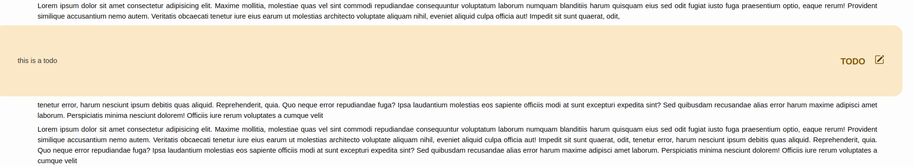

# New MarkDown

**New way to write in markdown**

NMD stands for **New MarkDown**, or for friends, *Nicola MarkDown* (if Stephen Bourne can name a shell, why can't I name mine NMD?)

> [!IMPORTANT]
> **TL;DR**: download [last NMD CLI tool](#nmd-command-line-interface).

## Overview

NMD is a custom Markdown dialect designed to enhance the classic Markdown syntax with additional features for styling and enriching text. With NMD, you can effortlessly create beautifully formatted text for your projects while enjoying some unique features tailored to modern needs.

NMD is full compatible with CommonMark standard.

### Why NMD?

#### Performance

Being developed in Rust, NMD has incredible performance. In single thread mode, NMD is 2 times faster than the compiler for VS Code, while in multi thread mode it is up to **10 times faster**, but having more features as more modifiers, integrated table of content and bibliography!

#### Extended Syntax

NMD introduces new modifiers and components to elevate your document styling.

For example, you can't emphasize section "work in progress" in common mark, but in NMD you can!

You can use [TODO](NMD.md#todo) modifier to emphasize a missed section:



Alternatively, do you want emphasize a section where you wrote a tip or warning comment? You can use [Focus Block](NMD.md#focus-block)


#### Order with Integrated Dossiers

Keep your documents organized with integrated "dossiers" for more intuitive and structured management.

#### Predefined Styles and Customization

- **Built-in Styles**: Choose from three predefined styles like Light, Dark, and Vintage, for a personalized reading experience.
- **Styling in Syntax**: Apply style directly in the text using NMD syntax.
- **Additional Page Styling**: Further customize the look of your page with additional styles.

- **Easy Integration**: Compile NMD files into HTML effortlessly for seamless integration with your web projects.
- **Open Source**: This compiler is open source under the GPL-3.0 License, allowing you to modify and adapt it to suit your needs.

#### Cool Factor

Why stick to Markdown when you can be cool using **NMD**?


## Syntax

You can find the current NMD's syntax to build nmd documents go to this [link](https://github.com/nricciardi/nmd-core/blob/main/NMD.md).

## NMD command line interface

You can download last release of **NMD command line interface** [here](https://github.com/nricciardi/nmd-cli/releases) or download it through [Cargo](https://github.com/rust-lang/cargo):

```shell
cargo install nmd
```

## NMD x VS Code

You can use the official [NMD x VS Code](https://github.com/nricciardi/nmd-vscode) extension!


## Author

Nicola Ricciardi

## Contributing

If you would like to contribute to the development of the NMD compiler, please follow [contribution guidelines](CONTRIBUTING.md).

## License

This project is licensed under the GNU General Public License v3.0 - see the [LICENSE](LICENSE) file for details.
