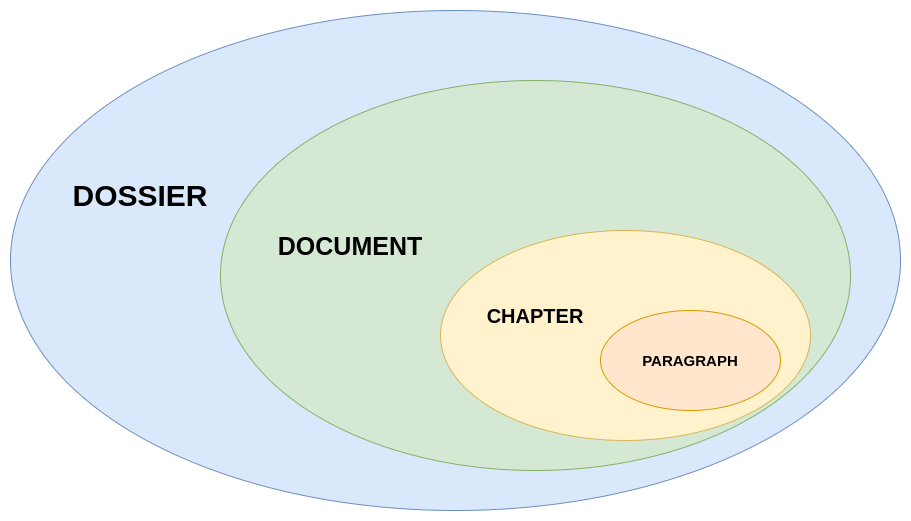

# New MarkDown [ALPHA]

[](LICENSE)
[](CHANGELOG.md)


- [New MarkDown \[ALPHA\]](#new-markdown-alpha)
  - [Overview](#overview)
    - [Features](#features)
  - [Develop](#develop)
    - [Planned Features](#planned-features)
    - [Features in Progress](#features-in-progress)
  - [Getting Started](#getting-started)
    - [Installation](#installation)
    - [Generate a new dossier using compiler](#generate-a-new-dossier-using-compiler)
      - [Compile dossier](#compile-dossier)
      - [HTML](#html)
  - [Structure](#structure)
      - [Dossier](#dossier)
        - [Dossier configuration](#dossier-configuration)
          - [name](#name)
          - [documents](#documents)
          - [style](#style)
          - [metadata](#metadata)
          - [compilation](#compilation)
  - [NMD Syntax](#nmd-syntax)
    - [Heading (Title of a chapter)](#heading-title-of-a-chapter)
    - [Inline modifier](#inline-modifier)
      - [Escape \[NOT SUPPORTED YET\]](#escape-not-supported-yet)
      - [Metadata \[NOT SUPPORTED YET\]](#metadata-not-supported-yet)
      - [Reference \[NOT SUPPORTED YET\]](#reference-not-supported-yet)
      - [Bold](#bold)
      - [Italic](#italic)
      - [Strikethrough](#strikethrough)
      - [Underlined](#underlined)
        - [Checkbox](#checkbox)
        - [Colors and Highlighted Text \[TO BE DEFINE; NOT SUPPORTED YET\]](#colors-and-highlighted-text-to-be-define-not-supported-yet)
        - [Compatible highlight text \[TO BE DEFINE; NOT SUPPORTED YET\]](#compatible-highlight-text-to-be-define-not-supported-yet)
      - [Custom text style \[TO BE DEFINE; NOT SUPPORTED YET\]](#custom-text-style-to-be-define-not-supported-yet)
      - [Emoji](#emoji)
      - [Superscript](#superscript)
      - [Subscript](#subscript)
      - [Link \[NOT FULLY SUPPORTED YET\]](#link-not-fully-supported-yet)
      - [Inline code](#inline-code)
      - [Inline math](#inline-math)
      - [Inline comments](#inline-comments)
      - [Bookmark \[TO BE DEFINE; NOT SUPPORTED YEY\]](#bookmark-to-be-define-not-supported-yey)
        - [Todo](#todo)
    - [Paragraph modifier](#paragraph-modifier)
      - [Paragraph styles and metadata \[TO BE DEFINE; NOT SUPPORTED YET\]](#paragraph-styles-and-metadata-to-be-define-not-supported-yet)
      - [Image](#image)
      - [Line break](#line-break)
      - [List](#list)
      - [Code block](#code-block)
      - [Multiline comments \[TO BE DEFINE; NOT SUPPORTED YET\]](#multiline-comments-to-be-define-not-supported-yet)
      - [Focus block \[NOT FULLY SUPPORTED YET\]](#focus-block-not-fully-supported-yet)
      - [Math block (LaTeX)](#math-block-latex)
  - [Author](#author)
  - [Contributing](#contributing)
  - [License](#license)


## Overview

**New MarkDown** NMD, a new way to write in markdown.

NMD is a custom Markdown dialect designed to enhance the classic Markdown syntax with additional features for styling and enriching text. With NMD, you can effortlessly create beautifully formatted text for your projects while enjoying some unique features tailored to modern needs.

NMD is full compatible with CommonMark standard.

### Features

- **Extended Syntax**: NMD introduces new modifiers and components to elevate your document styling.
- **Easy Integration**: Compile NMD files into HTML effortlessly for seamless integration with your web projects.
- **Open Source**: This compiler is open source under the GPL-3.0 License, allowing you to modify and adapt it to suit your needs.


## Develop

### Planned Features

- [ ] All modifiers
- [ ] Possibility to use a different dossier configuration name

### Features in Progress

- [x] Use file name instead of absolute path in dossier configuration
- [x] Other sections in dossier configuration to manage all options
- [x] Local math (no CDN)
- [x] List
- [ ] List creation check
- [ ] Link
- [ ] Quotation and "focus block"
- [ ] Base page style
- [ ] Paper format support (A4, A5, ...)
- [ ] Custom style
- [ ] Style modifier
- [ ] PDF compile format
- [ ] Tables
- [ ] Vintage style (typewriter)


## Getting Started

### Installation

To install NMD, follow these steps:

1. Download the last release based on your operating system
2. Extract files
3. Run `nmd` execution file 

### Generate a new dossier using compiler

To **generate a new dossier** you can use the following command:

```shell
nmd generate dossier -p your/final/directory/path/
```

There are many *flags* that you can use in combination with `generate dossier`. For example, if you want *force* the generation you can use `-f`, or if you want a *welcome page* you can use `-w`.

The Git support is planned, but not implemented yet. You can only add `.gitkeep` files in assets directories using `-k`.

#### Compile dossier

#### HTML

Compile a dossier in `html`:

```shell
nmd compile dossier -f html -i dossier/input/path -o artifact/output/path
```

> In this moment, to render *math block* and *inline math* an Internet connection is needed. This requirement will be removed in future version.


## Structure

There are several type of ways to write NMD.

The structure hierarchy is the following:

1. **Dossier**: structured project
2. **Document**: single NMD file having `.nmd` extension
3. **Chapter**: actual NMD text, it is identified by the heading and it has some paragraph
4. **Paragraph**: actual NMD text, it is the text block in a chapter. Each paragraph is separated by each other by two new lines (`\n\n`)



#### Dossier

A **dossier** is a structured project having one or more *NMD documents*.

It allows to manage a set of related NMD documents and their assets.

> **Asset** is a resource used in a document, e.g. an image, or a custom *style*. 

A dossier allows to write the content in different NMD files and than union them in a single output.

The actual structure of a dossier is the following:

- `assets/`
  - `images/`
  - `documents/`
  - `styles/`
  - ...
- `nmd.yml` or `nmd.json` called **dossier configuration**
- set of NMD document (having `.nmd` extension)

The `images/` directory contains... images! Such as `documents` which contains documents and `styles/` which contains custom style for dossier.

The custom style must be written in **CSS**. The CSS classes are specified in each following *modifier section*.

##### Dossier configuration

The **dossier configuration** is a YAML or JSON file which contains configuration parameters for the dossier.

Considering YAML version, it may have the following content:

```yaml
name: New Dossier

documents:
- ./welcome.nmd

style:
  theme: Light
  addons: []
  list_bullets_configuration: []

metadata: {}

compilation:
  embed_local_image: true
  embed_remote_image: true
  compress_embed_image: true
  strict_image_src_check: true
  parallelization: true
  use_remote_addons: false
```

###### name

`name` is the name of dossier.

###### documents

`documents` is a list where are specified the order of the documents in the final output.

###### style

`style` section has the *style configuration*.

`theme` specified the theme used to create output. It can be:

- `Light` (default)
- `Dark`
- `Vintage` is work in progress now 

`addons` is **not** used now. **[WIP]**

`list_bullets_configuration` is described in [list section](#list)

###### metadata

`metadata` is **not** used now. **[WIP]**

###### compilation

In `compilation` section you can specified the default values to use during compilation.

- `embed_local_image` (boolean): local images (specified by local path) are inserted in the output without reference, but embedded 
- `embed_remote_image` (boolean): remote images (specified by remote path, e.g. URL) are inserted in the output without reference, but embedded 
- `compress_embed_image` (boolean) **[WIP]**: compress embedded images
- `strict_image_src_check` (boolean): apply a strict check to image sources
- `parallelization` (boolean): if `true` parallelize execution of compilation
- `use_remote_addons` (boolean): if `true` use CDN instead of local CSS/Javascript to include third part library


## NMD Syntax

NMD syntax is based on [CommonMark](https://commonmark.org/), but add new concepts and modifiers.

> A **modifier** is a special combination of symbols which allows to modify the text style.

In the next section there are all modifiers of NMD.

### Heading (Title of a chapter)

**Style class**: `heading-#` (where `#` is the heading number, e.g. `heading-3`)

Create headings using `#` (up to 6 levels). `#` must be separated from text using a blank space ` `.

```markdown
# Heading 1
## Heading 2
...
###### Heading 6
```

It's possible to use this alternative format:

```
#1 Heading 1
#2 Heading 2
...
#6 Heading 6
```

### Inline modifier

TODO

#### Escape [NOT SUPPORTED YET]

You can prevent text modification using **escape**, i.e. `\`:

```
\*
\_
...
```

#### Metadata [NOT SUPPORTED YET]

**Metadata** are a set of data which gives information about document, project and so on.

The syntax is:

```
%metadata%
```

#### Reference [NOT SUPPORTED YET]

**Reference** is a... reference! You can use a fictitious name as a classic variable in the programming languages.

References must be set in `nmd.json`.

The syntax is below.

```
&reference
```

#### Bold

**Style class**: `bold`

```markdown
**Bold**

or

__Bold__
```

#### Italic

**Style class**: `italic`

```markdown
_Italic_

or

*Italic*
```

#### Strikethrough

**Style class**: `strikethrough`

```
~~Strikethrough text~~
```

#### Underlined

**Style class**: `underlined`

```
++Underlined text++
```

##### Checkbox

**Style class**: `checkbox`, `checkbox-checked`

```
[x] or [x]
[] or [ ]
```


##### Colors and Highlighted Text [TO BE DEFINE; NOT SUPPORTED YET]

Color can be written in hexadecimal if you use `#rrggbb` convention or you can use their names.

You can modify text color, text background and its font using this modifier:

```
[Custom colored text]{{textColor;backgroundColor;fontName}}
```

You can omit font and background color if you want only modify text color.

```
[Only text color]{#rrggbb}
```

You can insert only background color or only text font using this convention:

```
[Only background]{;#rrggbb}
[Only font]{;;fontName}
```

##### Compatible highlight text [TO BE DEFINE; NOT SUPPORTED YET]

You can use also `==Highlight text==`.

#### Custom text style [TO BE DEFINE; NOT SUPPORTED YET]

```
[Custom text style]{{style}}
```

There are some standard style such as the color names (to color text) and others.

#### Emoji

Two ways to add emoji:

- Copy and paste an emoji
- Using `:emojiCode:`, for example 🐫


#### Superscript

```
1^st^
```

> This modifier can be placed attached on other text.

#### Subscript

For example, if you want to write "water" in a more scientific way:

```
H~2~O
```

Pay attention, those are two single quote

> This modifier can be placed attached on other text.

#### Link [NOT FULLY SUPPORTED YET]

**Style class**: `link`

```markdown
[Link](http://a.com)
```

#### Inline code

**Style class**: `inline-code`

```markdown
`inline code`
```

#### Inline math

**Style class**: `inline-math`

```markdown
$inline math$
```

#### Inline comments

```
// this is a comment
```

#### Bookmark [TO BE DEFINE; NOT SUPPORTED YEY]

**Bookmarks** are label which can be inserted in text body to mark a paragraph or a piece of paragraph.

```
@[bookmark](description)
```

Description can be multi-lines or can be omitted:

```
@[bookmark]
```

##### Todo

Todo is a special tag to insert... TODOs

```
@[TODO]
```


### Paragraph modifier

TODO

#### Paragraph styles and metadata [TO BE DEFINE; NOT SUPPORTED YET]

In NMD each paragraph can be decorated with a set of **paragraph decorators**, i.e. **metadata**, **in-line styles** and **style classes**. 

There is a set of standard and custom styles which each indicates a particular style. These are guide lines, each editor could implement a standard style in different ways.

Metadata are introduced using `@`:

```
@ + metadata tag + single space + metadata content
```

Supported metadata:

- `author`
- `content` description of paragraph content
- `createdAt`
- `updatedAt`

A special metadata is the **id** which can be written in two alternatives ways:

```
#the-id
@id the-id
```

> the identifiers should be all in lowercase and each word should be separated using `-`.

Style classes are introduced using `.`, e.g. `.styleClass1`.

In-line styles use CSS (or SCSS/SASS based on editor) key-value modifiers, they haven't a symbol.

To add decorators to a paragraph you must insert `{}` in the line below title, in parenthesis each type of decorator has a particular symbol which introduces it. You can use `;` to separate decorator in the same line or a `\n` to insert decorator in multiple lines.

There is an example below.

```
## Foo title
{
    #the-id
    @author you
    @author yourFriend
    .styleClass1
    background-color: red
}
```

You can add decorators also to a single word using this syntax:

```
This [word]{#the-word; color: red} is red.
```


#### Image

**Style class**: `image`

```markdown

```

#### Line break

**Style class**: `line-break`, `line-break-dash`, `line-break-star`, `line-break-plus`

To apply a line break use `---` (or more than 3 `-`) or `***` (or more than 3 `*`) or `+++` (or more than 3 `+`) in a new blank line.

#### List

**Style class**: `list`, `list-item`, `list-item-indentation`, `list-item-bullet`, `list-item-content` 

Different types of list are supported in NMD, below the list with modifier

- `-` default style bullet
- `*` full dot bullet
- `+` empty dot bullet
- `->` arrow bullet
- `--` dash bullet
- `|` to use more than one line in an item content
- `-[] or -[ ] or - [] or - [ ]` todo bullet
- `1. or 1) or a. or a) or I. or I)` ordered bullet (numerical, alphabetical, romans numbers)
- `&unicode;` UNICODE bullet

Using `tabs` or `   ` (3 spaces) you can create different list levels.

Style of first and second bullet types can be managed using the configuration file.

Actually, the behavior of bullets can be modified using [dossier configuration](#dossier-configuration). In particular, using `list_bullets_configuration`.

For each record, you must specified 4 fields:

- `from` (string): NMD bullet
- `to` (string): output bullet (`:checkbox:` or `:checkbox-checked:` to show *checkbox* bullets)
- `indentation_level` (number)
- `strict_indentation` (boolean): if `false` the actual rule use `>=` instead of `==` to check indentation

> The rules are checked in order.

Following an example:

```yaml
  list_bullets_configuration:
  - from: '|'
    to: '&#8205;'
    indentation_level: 0
    strict_indentation: false
  - from: '-'
    to: '&bull;'
    indentation_level: 0
    strict_indentation: true
  - from: '-'
    to: '&#9702;'
    indentation_level: 1
    strict_indentation: true
  - from: '-'
    to: '&#8211;'
    indentation_level: 2
    strict_indentation: false
  - from: '*'
    to: '&bull;'
    indentation_level: 0
    strict_indentation: false
  - from: +
    to: '&#9702;'
    indentation_level: 0
    strict_indentation: false
```

#### Code block

**Style class**: `code-block`

Code blocks use ``` as paragraph modifier.

It's possible to specify the language used in code block, as in CommonMark, writing language name after first three quotes.

NMD uses [PrimJS](https://prismjs.com/) to render code blocks. So, the supported languages (tag in parenthesis) are the same of that library:

- Python (python)
- Java (java)
- Javascript (javascript)
- PHP (php)
- HTML (html)
- CSS (css)
- Typescript (typescript)
- Kotlin (kotlin)
- ...

#### Multiline comments [TO BE DEFINE; NOT SUPPORTED YET]

```
/*
multi
line
comment
*/
```

#### Focus block [NOT FULLY SUPPORTED YET]

**Style class**: `focus-block`, `focus-block-type` (replace `type`)

Focus blocks allow to insert text in particular paragraph in which the text is highlighted.

There are many types of focus block:

- **info**
- **warning**
- **danger**

The syntax is below.

```
::: warning
Watch out!!!
:::
```

#### Math block (LaTeX)

**Style class**: `math-block`

Math block is a particular paragraph used to print mathematical formulas and more.

The paragraph modifier for math block is double $, i.e. `$$` to open and close blocks.

NMD uses [Katex](https://katex.org/) to render math blocks.


## Author

Nicola Ricciardi

## Contributing

If you would like to contribute to the development of the NMD compiler, please follow our [contribution guidelines](CONTRIBUTING.md).

## License

This project is licensed under the GNU General Public License v3.0 - see the [LICENSE](LICENSE) file for details.
